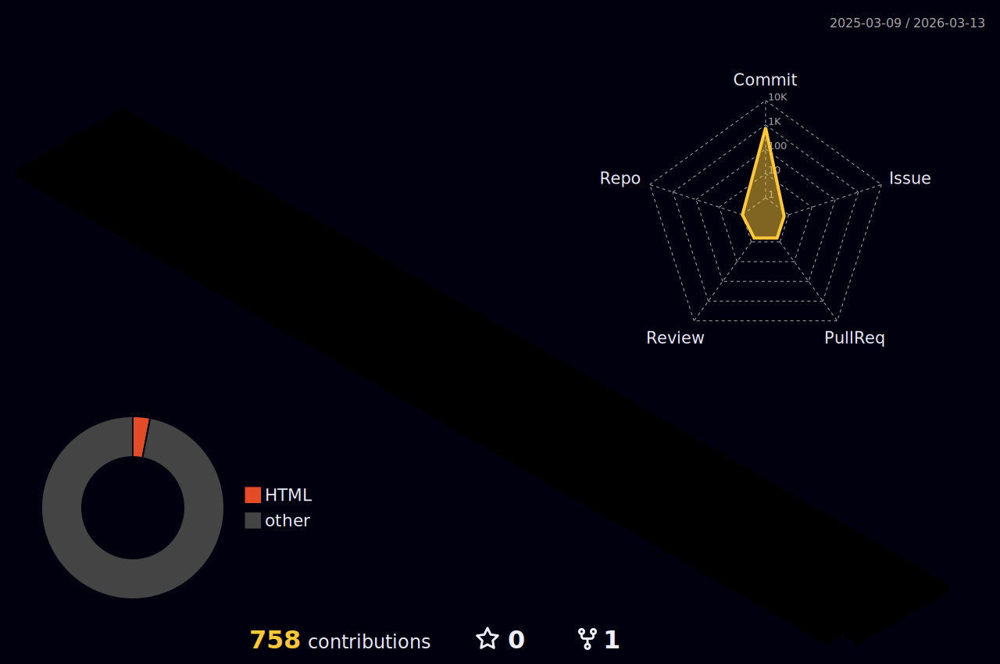

###  👋 Introduction

Hello! 안녕하세요! 
늘 학습하고 늘 성장하자!
I am trying to become a nice developer😎

---

  

### 📚프로그래밍 언어📚

    
  

### 🔍프레임워크 & 라이브러리🔍
      
  

### 💻데이터베이스 & 클라우드 호스팅💻
  
  

### 🔧소프트웨어 & 툴🔧

  

### 🎀GitHub Stats🎀
---------------
            

  

